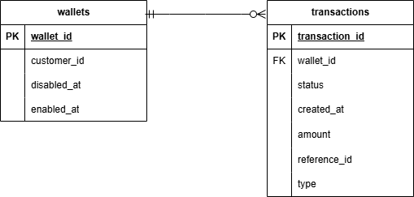

# DB Design

# How to install and run

# Docker (easier)

1. Adjust ports under `docker-compose.yml`. By default:

- Web server will start on port 8000. Adjust `fastapi_app.ports` if needed
- DB server will start on port 5432. Adjust `db.ports` if needed

2. Run `docker compose up`

# Without Docker

- Adjust environment variables under `.env` especially related to DB related environment variables. Please run `CREATE DATABASE` in your DB server first based on the `POSTGRES_DB_NAME`
- setup project: 
    - setup `venv`: 
        - `python -m venv venv`
        - `source venv/bin/activate` (could be diff depending on your OS)
    - install dependencies: 
        - `pip install -r requirements.txt`
        
    - `source .env`
    
- Run `uvicorn main:app --host localhost --port 8000`